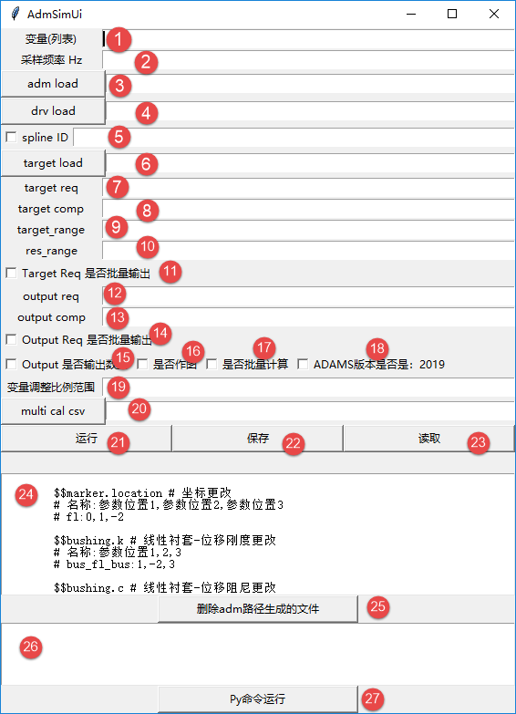
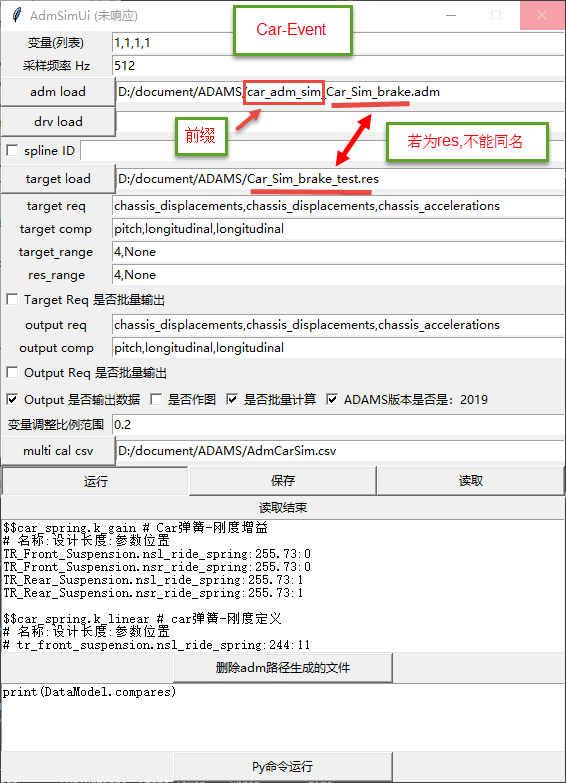
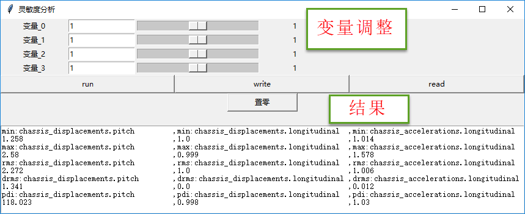

# ui
GUI模块，tkinter调用为主

+ tk_pyadams_main : 汇总各UI程序

+ tkui  
	+ 基于tkinter模块制作的快速UI生成模块

+ adm_sim 
	+ 基于tkui的adm模型仿真模块  
	+ 涉及 __灵敏度分析__ 、 __多线程计算__ 、 __Car&View分析__ 、 __多元线性回归__ 、 __对比评价__
	+ 评价形式(时域评价)
		+ 相对伪损伤
		+ 相对RMS
		+ 最大值
		+ 最小值
		+ RMS
	+ 分析范围  
		1. __Car-TILT侧翻稳定性__ 
		2. __Car-Event事件控制分析(制动\VPG\转弯)__ 
		3. __Car-Ride模块分析__  
		4. __View模型分析__
	+ 说明  
	  
		+ 按钮解析
		+ __1__ 变量输入逗号(,)作为间隔, 对顺序有要求, 尾部不能有逗号(,), 首位置为0, 用于 __24__ 更改设置中 ;
		+ __2__ 采样频率 单位Hz , 用于控制仿真步长(Car-Event除外), 与试验数据保持一致 ;
		+ __3__ adm文件路径(左侧按钮导入), 目标更改模型, Car-Event仿真需要对文件名加前缀:'car_adm_sim_' ;
		+ __4__ drv文件路径(左侧按钮导入), Femfat-lab迭代加载数据, 可不需要 , Car-Event\TILT不需要;
		+ __5__ drv文件加载对应,adm模型中的spline曲线的ID号. 左侧复选框勾选则 __4__ 与 __5__ 不激活,格式: 整数,与 __1__ 相同;
		+ __6__ 对比数据(格式:res\rsp\req)(左侧按钮导入),作为仿真目标对比数据。可为仿真本身或试验数据
		+ __7__ 目标request 数据 
			+ 若 __6__ 为req则为 reqId , 与Femfat-lab设置一致
			+ 若 __6__ 为res则为 request
		+ __8__ 目标component 数据
			+ 若 __6__ 为req则为 compId , 与Femfat-lab设置一致
			+ 若 __6__ 为res则为 component
		+ __9__  target_range,目标数据样点截取范围
			+ None,None 表示不截取
			+ 4,None 表示序号4以后所有数据为目标数据
			+ 4,1024 表示序号4到1024之间所有数据为目标数据
		+ __10__  res_range 仿真计算后处理样点截取范围
			+ 截取格式与 __9__ 一致
			+ 控制范围包含 output数据 __12__ 的输出
		+ __11__ 复选框,target_req是否批量输出
			+ 勾选,表示 __7__ request中的component数据一致,进行批量导出
				+ eg: 
					request: L_spring_force,R_spring_force
					component: Fx,Fy,Fz,Tx,Ty,Tz
					对应: L_spring_force.Fx 、 L_spring_force.Fy 、 L_spring_force.Fz ...
					共12通道数据
			+ 不勾选, __7__ 中request数据与 __8__ 中component数据分别对应,各数据长度与通道数一致,
				+ eg:
					__reqeust__ : chassis_displacements,chassis_displacements,chassis_accelerations
					__component__ : pitch,longitudinal,longitudinal
					对应: chassis_displacements.pitch 、 chassis_displacements.longitudinal 、 chassis_accelerations.longitudinal
					共3通道数据
		+ __12__ output_req 额外数据输出,csv格式
			+ 格式与 __7__ 一致
		
		+ __13__ ouput_comp 额外数据输出
			+ 格式与 __8__ 一致

		+ __14__ 复选框,output_req 是否批量输出
			+ 格式与 __11__ 一致

		+ __15__ 复选框,output数据是否输出
			+ 勾选,输出CSV数据,数据长度跟随 __10__ 而定
				+ 具有drv加载 __3__ 时,与drv文件保持同路径，同名称
				+ 没有drv加载时, 与运行的adm文件保持同路径，同名称

		+ __16__ 复选框,是否作图
			+ 勾选, 则每次计算输出时域&频域图像对比
			+ 若进行批量计算 __17__ , 不能勾选

		+ __17__ 复选框,是否批量计算
			+ 勾选, 进行灵敏度分析
			+ 勾选时,不能勾选 __16__

		+ __18__ 复选框,ADAMS版本是否是2019
			+ 不勾选,则版本为2017.2

		+ __19__ 变量调整比例范围
			+ 在变量 __1__ 的基础上进行比例增加&减小
			+ 用于批量计算 __17__
			+ 单一变量调整
			+ eg:
				__1__ : 1,2
				__19__ : 0.1
				变量调整: 
					0.9,2  、 1.1,2  、	1,1.8  、	1,2.2
		+ __20__ multi_cal csv 批量结果输出路径
			+ csv格式
			+ 包含灵敏度分析结果

		+ __21__ 运行程序
		+ __22__ 保存当前界面设置
		+ __23__ 读取界面设置

		+ __24__ 模型更改设置,与变量列表 __1__ 匹配
			+ \# 为注释
			+ $$ 为类型开头
			+ 参数列表 __1__ 起始位置为0
			+ 可更改范围:衬套刚度\阻尼、弹簧刚度、减振器阻尼
				+ 衬套刚度\阻尼设置,方向选项
					+ all 六个方向同时更改
					+ t 三个位移方向更改
					+ r 三个旋转方向更改
					+ tx、ty、tz、rx、ry、rz 各自方向更改
			+ 参数数据单位以ADM模型单位为准
			+ 长度:mm 质量:kg 力:N 弧度:rad
			+ 输入模板如下:

				$$bushing.k # 线性衬套-位移刚度更改 view模型  
				\# 共三个方向x,y,z,分别定义需要三个参数序号   
				\# 名称 __:__ 参数位置1,2,3  
				\# bus_fl_bus:1,2,3  

				$$bushing.c # 线性衬套-位移阻尼更改 view模型  
				\# 共三个方向x,y,z,分别定义需要三个参数序号  
				\# 名称 __:__ 参数位置1,2,3  
				\# bus_fl_bus:1,2,3  

				$$bushing.kt # 线性衬套-扭转刚度更改 view模型  
				\# 共三个方向x,y,z,分别定义需要三个参数序号  
				\# 名称 __:__ 参数位置1,2,3  
				\# bus_fl_bus:1,2,3  

				$$bushing.ct # 线性衬套-扭转阻尼更改 view模型  
				\# 共三个方向x,y,z,分别定义需要三个参数序号  
				\# 名称 __:__ 参数位置1,2,3  
				\# bus_fl_bus:1,2,3  

				$$bushing.force # 线性衬套-衬套预载更改 view模型  
				\# 共三个方向x,y,z,分别定义需要三个参数序号  
				\# 名称 __:__ 参数位置1,2,3  
				\# bus_fl_bus:1,2,3  

				$$sforce.k # 刚度设置 view模型  
				\# 名称 __:__ 参数位置  
				\# SPRING_1.sforce:4  

				$$sforce.c # 阻尼设置 view模型  
				\# 名称 __:__ 参数位置  
				\# eg: name:1  
				\# SPRING_1.sforce:5  

				$$car_bushing.k_gain # Car衬套-刚度增益  
				\# 名称 __:__ 方向选项 __:__ 参数位置  
				\# tr_steering.bkl_rack_housing_bushing:tx,ty,tz:6  

				$$car_bushing.c_gain # Car衬套-阻尼增益  
				\# 名称 __:__ 方向选项 __:__ 参数位置  
				\# tr_steering.bkl_rack_housing_bushing:tx:7  

				$$car_bushing.k  # Car衬套-线性刚度定义  
				\# 名称 __:__ 方向选项 __:__ 参数位置  
				\# tr_steering.bkl_rack_housing_bushing:tx,ty,tz:8  

				$$car_bushing.c  # Car衬套-线性阻尼定义  
				\# 名称 __:__ 方向选项 __:__ 参数位置  
				\# tr_steering.bkl_rack_housing_bushing:all:9  

				$$car_spring.k_gain # Car弹簧-刚度增益(放大\缩小)  
				\# 名称 __:__ 设计状态长度 __:__ 参数位置  
				\# tr_front_suspension.nsl_ride_spring:244:10  

				$$car_spring.k_linear # car弹簧-刚度定义(指定刚度)  
				\# 名称 __:__ 设计状态长度 __:__ 参数位置  
				\# tr_front_suspension.nsl_ride_spring:244:11  

				$$car_damper.c_gain # car减振器-阻尼增益(放大\缩小)  
				\# 名称 __:__ 参数位置  
				\# tr_front_suspension.dal_ride_damper:5  

				$$car_damper.c_linear # car减振器-阻尼定义(制定阻尼)  
				\# 名称 __:__ 参数变量- __拉伸阻尼__ __:__参数变量- __压缩阻尼__  
				\# TR_Rear_Suspension.dal_ride_damper:10:1  
				\# tr_front_suspension.dal_ride_damper:10:1  

		+ __25__ 删除adm路径生成的文件
			+ 主要删除 __3__ 同目录下,前缀为: 'view_adm_sim_' 的文件
			+ 文件主要为:view 模型生成

		+ __26__ python命令行输入
			+ 用于调试,不输入

		+ __27__ python命令执行
			+ 运行 __26__ 输入的文件

		+ 案例-Car-Event
			

	+ 多元线性预测
		+ 批量计算产生
		
		

+ view_adm_sim : adm_sim 的 __旧版__
	+ 多进程调用 multiprocessing

### view
Adams/View 应用模块,包含adams直接运行的py文件  
默认ADAMS版本: __2017.2__ , 其他版本特殊注明
+ drv2cmd:
	+ 将 __RPC3__ 格式的文件转为修改 ADAMS/spline的 __cmd__ 文件
+ view_fun     
	+ 基于Adams( _ADAMS/python_ )的子模块, 供相应的adams/python程序调用

+ rig_421_flex 
	+ adams/python 台架421创建, 加载台架上端以柔性体替代
	+ 调用 __view_fun__
+ rig_421_rev
	+ adams/python 台架421创建, 台架拆分两半  
	+ 调用 __view_fun__
+ rig_stewart_2017  
	+ adams/python 台架MAST创建, 六轴台架  
	+ 调用 __view_fun__
+ rig_stewart_2019  
	+ adams/python 台架MAST创建, 六轴台架
	+ 调用 __view_fun__ , __ADAMS version 2019__
+ rig_xyz : adams/python 台架XYZ创建, 六轴输入顺序 X、Y、Z、Rx、Ry、Rz

## program
相关项目

