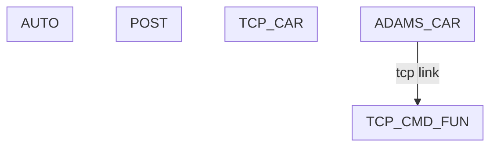
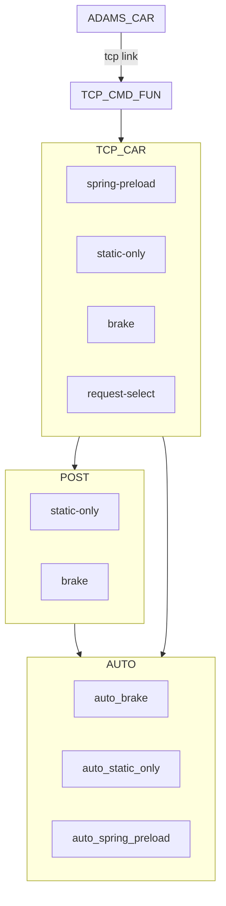

# TCP CMD
通过TCP控制adams

# win32com 操作 word

# 结构

--------------------
	ADAMS CAR 
--------------------
	TCP CMD FUN
--------------------
	TCP CAR
+ sim-static-spring-preload预载调整
+ sim-static-only(静态计算-整车状态输出)
+ sim-brake-制动迭代
+ request数据截取
--------------------
	POST
+ post-static-only-静态计算-整车状态
	+ word list处理输出

--------------------
	Auto
+ auto_brake
+ auto_static_only
+ auto_spring_preload

# 结构

----------------------------------
	ADAMS CAR 					
----------------------------------
	TCP CMD FUN					
----------------------------------
	TCP CAR					
+ spring-preload			
+ static-only					
+ brake						
+ request-select			
--------------------		
	POST					
+ static-only				
+ brake						
							
----------------------------------
	AUTO
+ auto_brake
+ auto_static_only
+ auto_spring_preload
----------------------------------

[mermaid](https://mermaid-js.github.io/mermaid/#/flowchart)

# 版本
version 1.12
    + 修改 get_aggregate_mass 函数
    + 
    + 